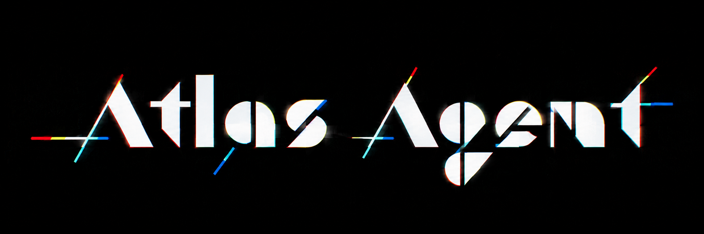

# Atlas Agent

**Atlas Agent is a self-improving AI trading agent that connects financial LLMs, broker tools, persistent memory, and deterministic risk controls into one local-first trading workspace.**

Atlas Agent is built for precision and safety. It treats the LLM as the reasoning engine and provides it with a professional-grade toolset to research markets, manage portfolios, and execute trades through a rigorous deterministic risk layer.

- **Local-first:** Your data, memory, and credentials stay on your machine.
- **Simulation-driven:** Paper trading is the default mode for all operations.
- **Tool-driven:** 49 builtin tool schemas for research, analysis, and execution.
- **Risk-gated:** Every action passes through a separate, deterministic guardrail system.

Use the model stack that fits your trading workflow — [OpenRouter](https://openrouter.ai), [NVIDIA NIM](https://build.nvidia.com), [Xiaomi MiMo](https://platform.xiaomimimo.com), [z.ai/GLM](https://z.ai), [Kimi/Moonshot](https://platform.moonshot.ai), [MiniMax](https://www.minimax.io), [Hugging Face](https://huggingface.co), [OpenAI](https://platform.openai.com/home), or any OpenAI-compatible/custom endpoint. Atlas Agent is provider-neutral by design: configure your provider once, switch models through `atlas configure`, and keep the execution, memory, and risk-control layers unchanged.

For finance-specific deployments, prefer models with strong results on dedicated finance-agent evaluations. The [Vals AI Finance Agent benchmark](https://www.vals.ai/benchmarks/finance_agent) is the recommended reference when selecting a model for market research, trading reasoning, and portfolio analysis.

## What Atlas Agent Is

Atlas Agent is a workspace where an AI agent lives, learns, and trades.

*   **The Agent:** A financial LLM (Claude, OpenAI, DeepSeek, etc.) acts as the decision-maker, processing market context and memory to form a thesis.
*   **The Tools:** How the agent interacts with the world. From pulling OHLCV data and web research to executing orders and updating trade journals.
*   **The Memory:** Persistent Markdown journals and logs allow the agent to carry lessons across sessions, deepening its "user model" and improving its skills over time.
*   **The Guardrails:** Deterministic risk controls (position sizing, daily loss limits, symbol policies) are decoupled from LLM reasoning to ensure safety.
*   **Simulation and Learning:** The default safety mode. Atlas Agent uses a high-fidelity `PaperBroker` for simulation without financial risk. During **closed-market** hours, Atlas focuses on research and the built-in **learning loop** to improve future planning.

## Current Status (v0.2.4)

| Component | Status | Description |
|---|---:|---|
| Setup Wizard | Implemented | First-run onboarding with persistent ASCII banner, keyboard-driven setup, and safe reconfiguration through `atlas configure`. |
| Secure Credentials | Implemented | Secrets are stored in `.env.atlas`, excluded from git, kept out of `config.json`, and protected during updates. |
| Provider-Neutral Models | Implemented | Supports OpenRouter, NVIDIA NIM, z.ai/GLM, Kimi/Moonshot, Hugging Face, OpenAI, and custom/OpenAI-compatible endpoints without lock-in. |
| Tool Registry | Implemented | 49 builtin tool schemas with JSON Schema validation, provider normalization, and compatibility aliases for legacy tool names. |
| Research Provider | Implemented | Configurable vendor-neutral web research provider with `ATLAS_RESEARCH_API_KEY` and legacy fallback compatibility. |
| Update System | Implemented | `atlas update` updates the system while protecting local config and sensitive files such as `.env.atlas`. |
| Risk Manager | Implemented | Deterministic gates for position size, loss limits, live trading safety, and symbol policy. |
| Agent Loop | In Progress | Transitioning from legacy routines toward a tool-driven autonomous reasoning loop. |
| Audit Hash-Chain | Planned | Tamper-evident audit logs for accountability, replay, and post-trade review. |
| Live Dashboard | Planned | Local observability for positions, P&L, tool calls, update state, and safety status. |

## Quickstart

```bash
# Install in editable mode
pip install -e .

# Start the setup wizard
atlas

# Check your configuration
atlas validate

# Run your first paper-trading cycle
atlas run --mode paper

# Keep Atlas updated
atlas update
```

1. **`atlas`**: Running bare `atlas` for the first time opens the interactive setup wizard. The wizard keeps the ASCII banner visible and collects your provider and broker credentials securely.
2. **`atlas run`**: Execution is explicit. Use `--mode paper` for safety and simulation.
3. **`atlas update`**: The official way to update. It preserves your `.env.atlas` and local configurations.

## Configuration

Atlas Agent uses a dual-layer configuration system to balance portability and security:

*   **`.atlas/config.json`**: Stores non-secret configuration like your default symbol, trading hours, and risk parameters.
*   **`.env.atlas`**: Stores sensitive API keys and broker secrets. This file is automatically ignored by Git and protected by the `atlas update` process.

Atlas Agent can optionally connect to a configurable web research provider for market/news lookup and external context gathering. The provider is user-selected. Atlas should not require or prefer a specific research vendor. Examples include hosted search APIs, self-hosted metasearch, browser automation providers, or custom HTTP/OpenAI-compatible endpoints.

```bash
# Optional generic research provider secret
ATLAS_RESEARCH_API_KEY=...
```

**Security Rule:** Never commit your API keys. Atlas Agent enforces this by protecting `.env.*` files from being staged or overwritten during updates.

## Update System

Do not use `git pull` as your primary update path. Use the built-in update command:

```bash
atlas update
```

The updater is designed to safely sync the latest Atlas Agent code while preserving your sensitive local files, including `.env`, `.env.atlas`, and custom workspace configs.

## Safety Model

*   **Simulation by Default**: Atlas Agent will never attempt live trading unless explicitly configured. Every **market-open** session begins with a simulation check.
*   **Deterministic Guardrails**: Risk controls and **risk gates** are hard-coded and separate from the LLM. If the LLM proposes an order that violates a risk rule, the `RiskManager` will block it before it reaches the broker.
*   **Broker Adapters**: Execution is normalized through secure adapters that implement strict validation.
*   **Approval Gates**: Live orders can be configured to require manual approval via `atlas approve-order`.
*   **Kill Switch**: Emergency stop for all trading activity.
*   **Responsibility**: You are responsible for your API keys, broker permissions, and any financial outcomes. Atlas Agent provides the tools; you provide the oversight.

## Architecture (v2 Direction)

```text
User / Scheduler / Event
     ↓
Agent Loop (Reasoning + Memory)
     ↓
Tool Registry (49 Builtin Tools)
     ↓
Market Data / Research / Memory / Broker / Update
     ↓
Guardrails + Audit + Risk Controls
```

## Commands

| Command | Purpose |
| :--- | :--- |
| `atlas` | Open setup wizard or show status. |
| `atlas configure` | Re-run the interactive setup wizard. |
| `atlas validate` | Check local configuration and safety gates. |
| `atlas run --mode paper` | Start the autonomous agent in simulation. |
| `atlas run --mode live` | Attempt live-mode pass (requires explicit opt-in). |
| `atlas update` | Safely update Atlas Agent to the latest version. |
| `atlas kill-switch status` | Check the status of the global kill switch. |

*Note: Legacy `routine` commands are still available for backward compatibility but are being phased out in favor of the unified `run` architecture.*

## Telegram Control Plane

Atlas Agent provides an optional Telegram interface for remote status updates and guarded action approval. This is a control-only layer; execution remains governed by the local risk manager.

## Deployment and Cloud

Atlas is designed for local-first operation but can be deployed to a VPS, Docker container, or serverless job for continuous monitoring. Always ensure your environment variables are secured in your deployment target.

## Roadmap

1. **Complete Agent Loop**: Full autonomous tool-use integration.
2. **Audit Log v2**: Hash-chained records for immutable trade history.
3. **Portfolio Risk Manager**: Correlation-aware risk management.
4. **Hybrid Memory Search**: Combining vector and keyword search for perfect recall.
5. **Streaming Event Bus**: Real-time updates for status and execution.
6. **Observability Dashboard**: Local web-based monitor.

## Disclaimer

**Not Financial Advice.** Atlas Agent is a software tool, not a financial advisor. Trading involves significant risk of loss. Live trading can lose real money. You are solely responsible for your deployment, risk limits, and any financial results. Use Paper Mode until you are fully confident in your strategy and configuration.

---
Built by Natan Mucelli.
